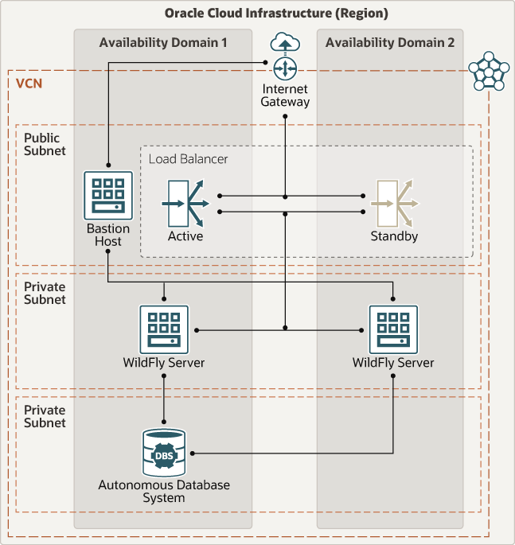

# terraform-oci-arch-jboss-wildfly-atp 

## Introduction

WildFly supports the latest standards for REST-based data access, including JAX-RS 2, and JSON-P. Building on Jakarta EE provides rich enterprise capabilities in easy to consume frameworks that eliminate boilerplate and reduce technical burden.

## Reference Archirecture

For details of the architecture, see [_Deploy WildFly connected to an autonomous database_](https://docs.oracle.com/en/solutions/wildfly-oci/index.html)

## Architecture Diagram


## Prerequisites

- Permission to `manage` the following types of resources in your Oracle Cloud Infrastructure tenancy: `vcns`, `internet-gateways`, `route-tables`, `network-security-groups`, `subnets`, `autonomous-database-family`, and `instances`.

- Quota to create the following resources: 1 VCN, 3 subnets, 1 Internet Gateway, 1 NAT Gateway, 2 route rules, 1 Load Balancer, 1 ATP instance, and 3 compute instances (bastion host + 2 JBoss servers).

If you don't have the required permissions and quota, contact your tenancy administrator. See [Policy Reference](https://docs.cloud.oracle.com/en-us/iaas/Content/Identity/Reference/policyreference.htm), [Service Limits](https://docs.cloud.oracle.com/en-us/iaas/Content/General/Concepts/servicelimits.htm), [Compartment Quotas](https://docs.cloud.oracle.com/iaas/Content/General/Concepts/resourcequotas.htm).

## Deploy Using Oracle Resource Manager

1. Click [](https://cloud.oracle.com/resourcemanager/stacks/create?region=home&zipUrl=https://github.com/oracle-devrel/terraform-arch-oci-jboss-wildfly-atp/releases/latest/download/terraform-oci-arch-jboss-wildfly-atp-stack-latest.zip)

    If you aren't already signed in, when prompted, enter the tenancy and user credentials.

2. Review and accept the terms and conditions.

3. Select the region where you want to deploy the stack.

4. Follow the on-screen prompts and instructions to create the stack.

5. After creating the stack, click **Terraform Actions**, and select **Plan**.

6. Wait for the job to be completed, and review the plan.

    To make any changes, return to the Stack Details page, click **Edit Stack**, and make the required changes. Then, run the **Plan** action again.

7. If no further changes are necessary, return to the Stack Details page, click **Terraform Actions**, and select **Apply**. 

## Deploy Using the Terraform CLI

Now, you'll want a local copy of this repo. You can make that with the commands:

```
    git clone https://github.com/oracle-devrel/terraform-arch-oci-jboss-wildfly-atp.git
    cd terraform-arch-oci-jboss-wildfly-atp
    ls
```

## Prerequisites
First off, you'll need to do some pre-deploy setup.  That's all detailed [here](https://github.com/cloud-partners/oci-prerequisites).

Create a `terraform.tfvars` file, and specify the following variables:

```
# Authentication
tenancy_ocid         = "<tenancy_ocid>"
user_ocid            = "<user_ocid>"
fingerprint          = "<finger_print>"
private_key_path     = "<pem_private_key_path>"

# Region
region               = "<oci_region>"

# Compartment
compartment_ocid     = "<compartment_ocid>"

# ATP
atp_password         = "<atp_password>"

# JBoss Config
jboss_admin_password = "<jboss_admin_password>"

````

## Create the Resources
Run the following commands:

    terraform init
    terraform plan
    terraform apply


## Testing deployment 

### Access the Admin Console

There is no application deployed, but once deployed applications will be available at

http://<LOAD_BALANCER_IP>/

To access the admin console, you have 2 options:

### Access the console through a SOCKSv5 proxy

Create a SOCKSv5 proxy through the public IP of the bastion host.

For example SOCKS v5 proxy on port 1088

```bash
ssh -C -D 1088 opc@150.136.41.148
```

Then configure your browser to use a manual SOCK5 proxy, (On Firefox, click **Preferences**, then search for **PROXY**, and click **Settings**). Select Manual Proxy, and SOCKSv5 option. Pass it 'localhost' as the host and 1088 as the port.

You can then connect through the browser using the Private IP of the server.

For example: http://10.1.2.2:9990/ to reach the WildFly console.

### Access the console through SSH tunnel

You can tunnel to the jboss instance through the bastion host with 

```bash
export BASTION_IP=<bastion-ip>
export JBOSS_HOST=<jboss-host-private-ip>

# tunnel
ssh -M -S socket -fnNT -L 9990:${JBOSS_HOST}:9990 opc@${BASTION_IP} cat -
ssh -S socket -O check opc@${BASTION_IP}
```

Then the admin console will be available on localhost at: http://localhost:9990/
 
### SSH to a JBoss instance

You can SSH to the JBoss instance using:

```bash
ssh -J opc@${BASTION_IP} opc@${JBOSS_HOST}
```

or if you need to pass a private key identity, use:

```bash
ssh -o ProxyCommand="ssh -W %h:%p -i <private_key> opc@${BASTION_IP}" -i <private_key> opc@${JBOSS_HOST}
```

### SCP files to a JBoss instance

To SCP files to the JBoss instance (i.e. to deploy applications)

```bash
scp -o ProxyCommand="ssh -W %h:%p opc@${BASTION_IP}" <file-to-transfer.ext> opc@${JBOSS_HOST}:~/
```

## Contributing
This project is open source.  Please submit your contributions by forking this repository and submitting a pull request!  Oracle appreciates any contributions that are made by the open source community.

### Attribution & Credits
Initially, this project was created and distributed in [GitHub Oracle QuickStart space](https://github.com/oracle-quickstart/oci-jboss-wildfly-atp). For that reason, we would like to thank all the involved contributors enlisted below:
- Emmanuel Leroy (https://github.com/streamnsight) 
- Lukasz Feldman (https://github.com/lfeldman)


## License
Copyright (c) 2022 Oracle and/or its affiliates.

Licensed under the Universal Permissive License (UPL), Version 1.0.

See [LICENSE](LICENSE) for more details.

